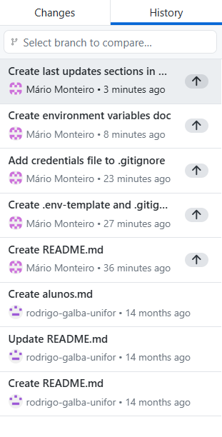

# Trabalho final de gestão de configuração.

## Variáveis de Ambiente 

| Variável | Descrição |
| - | - |
| API_URL: | URL da API. |
| PORT: | Porta em que a aplicação será executada. |
| DEBUG: | Define a ativação do modo DEBUG. | 
| USER: | Usuário principal da aplicação. | 
| TOKEN: | Chave de acesso para a aplicação. |

## Imagens 

## Últimas Alterações 

- Documenta variáveis de ambiente no README.md 

